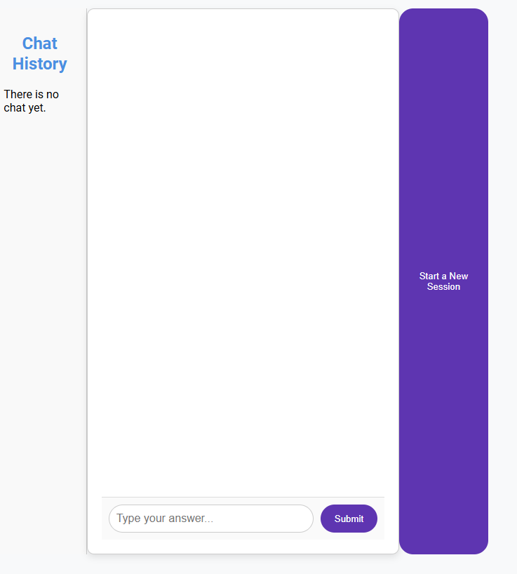
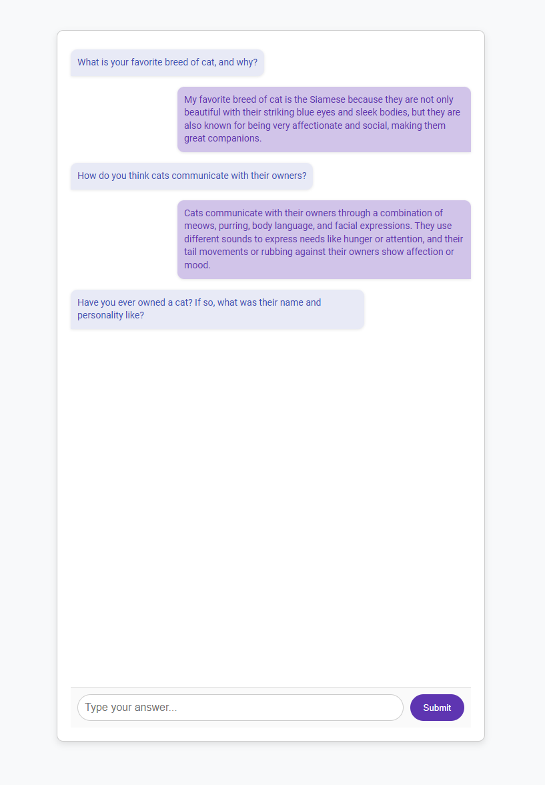
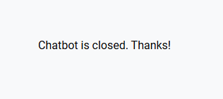
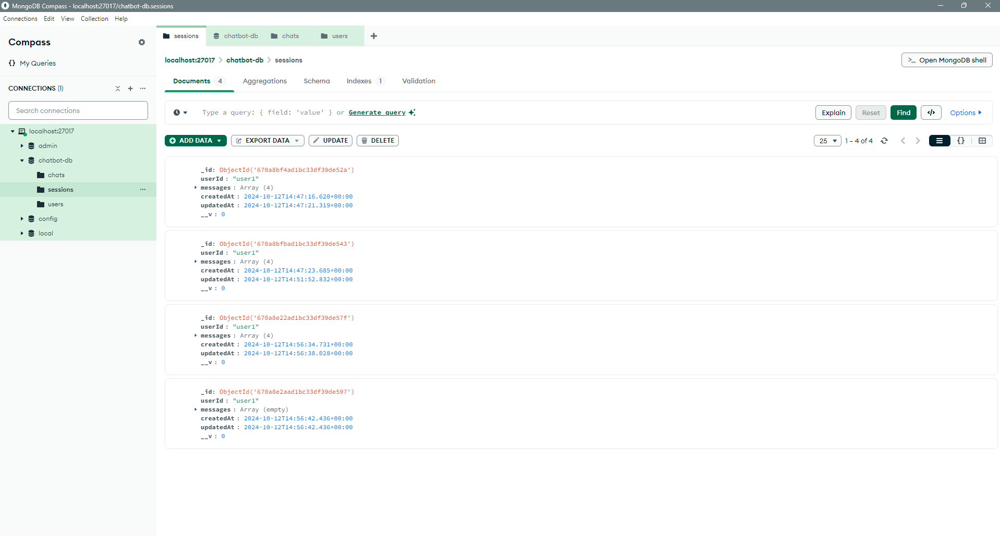

# Cat Chatbot

This project is a **Chatbot** application developed using ReactJS and NestJS. It asks users 10 predefined questions and saves the answers in a MongoDB database. Optionally, dynamic questions can be generated using OpenAI integration.

## Table of Contents

- [Features](#features)
- [Installation](#installation)
- [Usage](#usage)
- [Screenshots](#screenshots)
- [Technologies](#technologies)
- [Contributors](#contributors)
- [License](#license)

## Features

- Asks the user 10 predefined questions.
- Saves user responses in the MongoDB database.
- Tracks user responses step by step.
- Optionally supports dynamic question generation using OpenAI.
- Session management and response history tracking.

## Installation

### Required Dependencies

- Node.js
- Nest
- MongoDB
- Git

### Step 1: Clone the Repository

```bash
git clone https://github.com/vitalvirtue/chatbot-nest-openai.git
cd cat-chatbot
```

### Step 2: Install Backend and Frontend Dependencies

#### Backend:

```bash
cd backend
npm install
```

#### Frontend:

```bash
cd ../frontend
npm install
```

### Step 3: Create the .env File

In the backend directory, create a `.env` file with the following content:

```
MONGODB_URI=mongodb://localhost:27017/chatbot-db
OPENAI_API_KEY=your-openai-api-key-here  # If you're using OpenAI
```

### Step 4: Start MongoDB

```bash
mongod
```

or Start MongoDB Compass

Don't Forget Sample User on users collection is :

```json
{
  "userId": "user1",
  "sessionStart": "2024-10-08T10:00:00Z",
  "sessionEnd": null,
  "questionsAnswered": 0
}
```

### Step 5: Start Backend and Frontend

#### Backend:

```bash
npm run start
```

#### Frontend:

```bash
npm start
```

### Step 6: Open the Application

Go to `http://localhost:3000` in your browser. The Chatbot application will be running here.

## Usage

- When the application starts, the first question will be asked.
- As the user answers each question, the next question is shown.
- Once all questions are answered, the chatbot closes and a thank-you message is displayed.
- The answers are saved in the MongoDB database.

## Screenshots

Below are the screenshots showing different parts of the application.

### 1. **Main Screen (Chatbot Start)**

Shows the chatbot's starting screen when the first question is asked.



### 2. **User Answer Screen**

Shows the user's answer to a question and the next question being asked.



### 3. **Chatbot End Screen**

The closing message shown when all questions are answered.



### 4. **Database View (MongoDB)**

Shows the answers saved in the `chats` collection via MongoDB Compass or Shell.



## Technologies

- **Frontend**: ReactJS
- **Backend**: NestJS
- **Database**: MongoDB
- **Optional**: OpenAI API

## Contributors

- [Hayati Erdem Özkümüş](https://github.com/vitalvirtue) - Project Owner

## License

This project is licensed under the MIT License - see the [LICENSE](./LICENSE) file for details.
